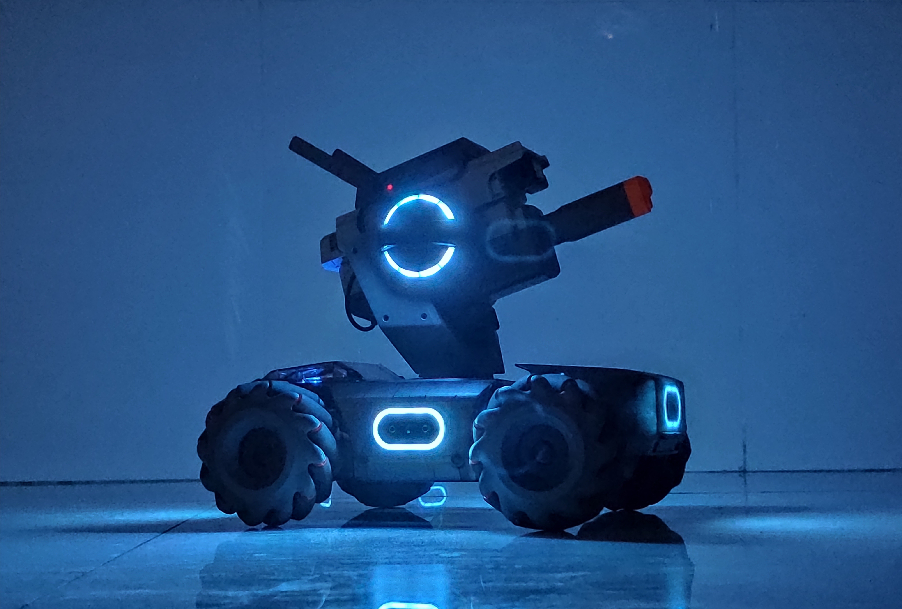

# 机器人工程师的成长之路
`author:`周恒

`date:`2020/3/13

## 学习建议
> 作为机械工程学院的学生，我的目标就是成为一名机器人工程师，但是很现实，我们本科阶段的课程甚至都不足以让我们成为一名合格的工程师，因为我们的课程大多仅局限于上世纪已经存在的理论，这些理论固然重要，但是我们是工科，更需要实践和动手能力。因此我觉得我作为一名大四的学长，需要给学弟学妹们提一些建议：

* 1）寻找一位工程界的大佬作为自己的引路人。我当初还是一个小白的时候，有幸看到了DJI的一位大佬工程师YY硕的文章，叫[机器人工程师学习计划](https://zhuanlan.zhihu.com/p/22266788),建议大家看一下，当时对我的影响是巨大的，让我有了学习规划，了解到了行业前沿，不再是一只井底之蛙，并且当你有了引路人后，你也会很容易通过他了解到这个行业更多的大佬，获取更多前沿的技术。

* 2） 要有兴趣。我认为建立兴趣最好的方法就是自己DIY一个作品出来，我当初入门学习单片机的时候想要给寝室做一套门禁系统，就到处在网上找资料，找代码，通宵调程序，最终做出来了，既可以用带NFC的手机进行开门，还可以通过语音来进行开门。这让我有了强烈的自信心，所以在接下来的学习中信心满满，很快就入了航模的坑，研究飞控代码，最终将飞控中的一些先进技术应用到了我开发的步兵机器人。但是我还是不满足现有的功能，因为它只能算半自动化机器人，还是需要人进行操控，所以我有了一个大胆的想法，就是开发出一台全自主的步兵机器人，不需要人为干预，因此我了解了[ROS](https://www.ros.org/),SLAM这些前沿技术，然后我就花巨资(其实当时也就花了499大洋)去[深蓝学院](https://www.shenlanxueyuan.com/courselist/robot)买了相关的课程学习，目前我也做出来了一些成果，但是离全自主化的机器人目标还有很远，我还需要不断的学习，实践。就如前段时间小米发布会想冲击高端市场所说的，我们的目标是星辰大海

* 3） 要学会站在巨人的肩膀上进行学习。如果每个功能都需要我们自己开发，那么时间成本是巨大的，在初期学习中，我们可以自己从零到有，但是当自己有一定基础后，建议多去[GitHub](https://github.com/izh20)上研究别人出色的代码，并download到本地运行一下试试，或者去[robomaster论坛](https://bbs.robomaster.com/forum-technology-1.html)下载别人的开源资料，从中也会学到很多知识。而且这些不同于课本上枯燥的理论，你可以很快的从里面获取到成就感。然后再学习相关理论知识会轻松的多。

## 常用工具介绍
>在这两年的学习当中，我也走过很多弯路，从中吸取到很多教训，因此我总结了两个工具，他们可以为我们接下来的学习中提供巨大的帮助：
* `GitHub`,它可以帮助我们进行代码管理，我们每次迭代的代码都可以上传到GitHub中去，如果想要回退到过去的版本，也会非常容易，为我们的电脑节省了非常多的空间。同时GitHub上有很多开源项目，希望大家多研究研究。对于还不了解GitHub的同学，你们可以把他类比于中国[知网](https://www.cnki.net/),但知网是收费的，GitHub是免费的。
* `markdown`,它是一种轻量级标记语言，它允许人们使用易读易写的纯文本格式编写文档。说人话就是我们的课程设计报告，论文 (说到写论文可以去了解一下`LATEX`，会为你打开一个全新的大门，在此我推荐一个[中科大论文模板的开源项目](https://github.com/mohuangrui/ucasproposal),也偷偷推荐一波我们湖工大佬开源的[湖工论文模板](https://github.com/JasonDENHJD/HBUT-PaperTranslate)) ，开发日志等所有你需要用word，或wps这种软件编辑的文档，markdown都可以帮你胜任，并且你不需要关注格式，只需注重内容，当我不知道markdown时，每次用word编写好后，都要花费大量时间用在调整格式上，当我上手markdown后，真香。对于开发者来说，劝大家少用word，多用markdown。
### GitHub教程
* [GitHub完整教程](https://www.liaoxuefeng.com/wiki/896043488029600)
* [GitHub快速入门教程 : 如何在github上传本地项目代码](https://blog.csdn.net/jackson23333/article/details/81315474)

> 之前也询问过大家对于GitHub上使用出现过的一些问题，再结合我的使用情况，目前使用GitHub最大的问题就是下载速度太慢，由于服务器在国外，很多时候只有几kb/s的速度
### markdown教程
* [markdown菜鸟教程](https://www.runoob.com/markdown/md-tutorial.html)

## 机器人学习路线
>以下五个方向的项目我认为是可以在本科或研究生期间完成的项目，找准一个方向，并朝着这个方向挖掘知识把，争取本科毕业可以完成其中的一个项目
* 1. 手写双目视觉里程计。涉及到图像处理、特征匹配、位置解算、空间变换等等。

* 2. 手写四旋翼飞行器基于GPS的轨迹规划。涉及到深挖四旋翼飞行器的运动原理、IMU原理、轨迹生成和优化等。

* 3. 造一个被推了也不会倒的四足舵机机器人。涉及到舵机控制、倒立摆建模、动力学分析、PID控制、IMU原理等。

* 4. 深度学习训练一个小车追人跑。涉及到深度学习工具包使用、数据集采集、数据集分析、小车控制等。

* 5. 机械臂给人端茶倒水。这个相对来说土豪一点，因为能直接拿来用的机械臂都很贵，这个就要看有没有找到[富婆](https://baike.baidu.com/item/富婆/24105672?fr=aladdin)了。涉及到多自由度机械臂原理的学习、工具包的使用、轨迹规划等等。
## 总结